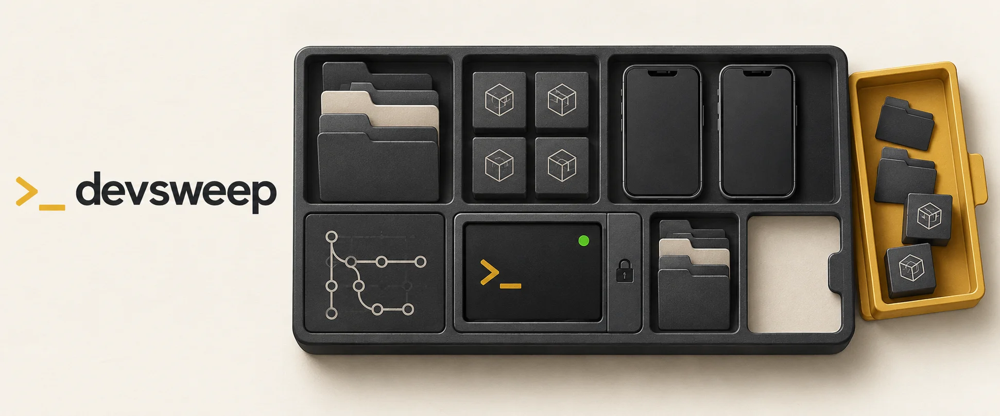

# devsweep



**Reclaim disk space from your developer toolchain, in one terminal UI.**

Projects leave behind build artifacts. Coding agents leave worktrees. Mobile
toolchains, Docker and package managers keep accumulating data. devsweep brings
it into one place: see the size and status of each item, choose what can go,
and review the removal commands before confirming.

Built with Rust and ratatui. Runs on **macOS, Linux and Windows** (Windows is experimental). MIT licensed.

## Quick start

```sh
npx @tarcisiopgs/devsweep            # scan the current folder and the machine
npx @tarcisiopgs/devsweep ~/code     # scan another projects folder
```

Or install it once:

```sh
npm install -g @tarcisiopgs/devsweep
devsweep ~/code
```

Node.js and npm are needed for the npm launcher. devsweep itself runs as a
native binary. You can also download the binary for your system from
[GitHub Releases](https://github.com/tarcisiopgs/devsweep/releases/latest),
or build from source with `cargo build --release`.

| System | Architectures | Sources |
|---|---|---|
| macOS | Apple silicon, Intel | all of them |
| Linux | x64, arm64 | all except iOS, Xcode and Homebrew, which only exist on macOS |
| Windows (experimental) | x64, arm64 | the same as Linux |

The Linux binary is statically linked and does not depend on the
distribution's libc.

**Windows support is experimental.** It passes the same test suite on a
Windows runner, including the checks that keep junctions and protected folders
from being removed, but the interface has not yet been reviewed on a real
Windows machine. Read the review screen with extra care there, and please
[report](https://github.com/tarcisiopgs/devsweep/issues) what looks wrong.

## From scan to cleanup

1. **Scan.** Project artifacts and repository worktrees appear under **This
   folder**. Caches, mobile toolchains, Docker and agent worktrees appear under
   **Machine**. Results arrive while sizes are still being calculated.
2. **Choose.** Browse sources, sort by size or age, and select individual items.
   Detected live processes, booted simulators and running emulators lock affected
   items so they cannot be selected.
3. **Review.** Press `enter` to see the selection, total size and removal commands.
   Press `esc` to go back or `y` to confirm. Each item is checked again before removal.
4. **Follow up.** The receipt shows what was freed and what was left alone. When
   removed worktrees leave merged branches behind, press `b` to review and delete them.

## Know what you are removing

- **Worktrees have context.** See merged, dirty and stale status. Worktrees with
  unknown Git status are locked; eligible clean, merged worktrees can be preselected.
- **Merged branches go with their worktrees.** After a removal, devsweep offers
  to delete the branches the removed worktrees left behind, but only those whose
  work is already in the default branch (merged or squash-merged). They go
  through the same review, with `git branch -D` shown for each one.
- **Preselected does not mean “everything disposable.”** Project artifacts,
  Android AVDs, iOS runtimes, Docker volumes, Xcode archives and the Trash are
  left for you to choose.
- **Native cleanup commands are preferred.** devsweep uses commands such as
  `git worktree remove`, `xcrun simctl delete`, `avdmanager delete avd`,
  `pnpm store prune` and `brew cleanup` when available.
- **The review is the decision point.** Scanning does not delete anything.
  Results that arrive after you open the review cannot join that selection.

Cleanup is destructive. An unused Docker volume may contain a database; a
worktree may contain files you still need. Check the selected items and commands
before pressing `y`.

## What it finds

Sources appear when the relevant tools are installed. On macOS, some locations,
including the Trash, may need Full Disk Access for your terminal; devsweep shows
a prompt when access is missing.

| Source | Section | Preselected when |
|---|---|---|
| Project artifacts: `node_modules`, `.venv`, `Pods`, `.next`, `.expo`, `.gradle`, `.cxx`, `target`, `vendor`, `__pycache__`…; `dist`/`build`/`out` only when git ignores them, and never a folder holding files git tracks; app builds (`.ipa`, `.apk`, `.aab`) that git does not track | This folder | never |
| Git worktrees of the repositories in the folder, outside the agent folders below | This folder | merged, clean, no ignored files beyond build artifacts, and unlocked |
| Agent worktrees in `~/.codex/worktrees`, `~/orca/workspaces`, `~/.claude-squad/worktrees` | Machine | merged, clean, no ignored files beyond build artifacts, and unlocked |
| iOS simulators and runtimes (macOS) | Machine | the simulator is unavailable |
| Android AVDs and system images | Machine | never |
| Docker dangling images, build cache, unused images, stopped containers, orphan volumes | Machine | dangling images and build cache |
| Dev tool caches (npm, pnpm, bun, Yarn, pip, uv, Go, Cargo, Gradle, RubyGems, Expo, CocoaPods, Xcode, Clang, Playwright, Claude, Codex…) | Machine | the cache regenerates and costs nothing to rebuild |
| Xcode device support files and archives (macOS) | Machine | never |
| Homebrew cleanup (macOS) | Machine | unlocked |
| The Trash. On macOS Finder empties it, mounted volumes' included. On Linux `gio trash --empty` does when it can reach a trash service; otherwise only the home Trash is emptied. On Windows the Recycle Bin is emptied with `Clear-RecycleBin` | Machine | never |

**Safe** means: it regenerates by itself, nothing is lost, and recreating it
costs nothing relevant. Download caches regenerate too, but the next build
downloads everything again, so they are listed and left for you to decide.

## Keys

| Key | Action |
|---|---|
| `↑` `↓` / `j` `k` | move |
| `tab` / `←` `→` | switch pane |
| `space` | toggle item |
| `a` | toggle all unlocked items of the source |
| `s` | sort by size, name or age |
| `/` | filter |
| `r` | scan again |
| `?` | key and mark legend |
| `o` | open the Full Disk Access settings, when a source needs it (macOS) |
| `⏎` | review what will be removed |
| `y` | confirm on the review screen |
| `esc` | go back from review |
| `q` / `ctrl-c` | quit; during removal, stop after the current item |

When a removal finishes, devsweep posts a desktop notification with the result:
always on macOS, and on Linux when `notify-send` is installed. On Windows the
terminal bell is the only signal. Pass `--no-notify` to turn it off.

## Scope

Use devsweep when disk space is tied up in projects, coding-agent worktrees or
development tools. It combines project cleanup and machine cleanup in one
interactive workflow.

For tools focused on project artifacts, see
[npkill](https://github.com/voidcosmos/npkill) and
[kondo](https://github.com/tbillington/kondo). For broader Mac maintenance, see
[Mole](https://github.com/tw93/Mole). devsweep focuses on developer resources
and the Trash; browser cleanup and app uninstallation are outside its scope.

## Contributing

Add a dev tool cache by writing a rule in `catalog/*.toml`, or contribute a
scanner for another source. See [CONTRIBUTING.md](CONTRIBUTING.md) for the
catalog schema, safety rules and development commands.

## License

[MIT](LICENSE)
